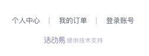
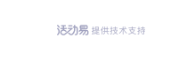

# 底部弹框组件

> Vue.js 2.x C端的业务组件。

[](https://www.npmjs.org/package/emfooter)

[](https://saucelabs.com/u/_wmhilton)

## 安装

```
$ yarn add emfooter
```

# 底部弹框(wap)
> 基于Vue.js 的 前端业务组件。

## 投诉

> 0.5.0 新增。添加属性 <code>complaint</code> 即可。

[浏览器手机模式在线预览](https://output.jsbin.com/belehox)


<div style="background: #999">
  <w-footer-wap
    mode="none"
    logoColor="white"
    complaint
    complaintLink="https://www.evente.cn"
  />
</div>

``` vue
<w-footer-wap
  mode="none"
  logoColor="white"
  complaint
  complaintLink="https://www.evente.cn"
/>
```

## 没有主办图片的

[浏览器手机模式在线预览](https://output.jsbin.com/zecepul)



``` vue
<w-footer-wap
  centerLink="https://www.baidu.com"
  orderLink="https://www.qq.com"
  orgid="100015"
  :loginAction="loginAction"
  :countrycodeAction="countrycodeAction"
  :sendAction="sendAction"
/>
```

## 主办图片

[浏览器手机模式在线预览](https://output.jsbin.com/cetuwip)


``` vue
<w-footer-wap
  centerLink="https://www.baidu.com"
  orderLink="https://www.qq.com"
  orgid="100015"
  orgImg="https://2img.evente.cn/7b/7b/81/a9b42253e54228e580d3b898be.jpg"
  :loginAction="loginAction"
  :countrycodeAction="countrycodeAction"
  :sendAction="sendAction"
/>
```

## 只有底部图片

[浏览器手机模式在线预览](https://output.jsbin.com/jeferij)

> 只需添加 `mode="none"` 即可。



``` vue
<w-footer-wap mode="none" />
```

## API

<table>
  <thead>
    <tr><th>参数</th><th>说明</th><th>类型</th><th>是否必填</th><th>默认值</th></tr>
  </thead>
  <tbody>
    <tr><td>centerText</td><td>个人中心文案</td><td>String</td><td>否</td><td>个人中心</td></tr>
    <tr><td>centerLink</td><td>个人中心链接</td><td>String|Number</td><td>否</td><td>wap/personal</td></tr>
    <tr><td>orderText</td><td>我的订单文案</td><td>String</td><td>是</td><td>我的订单</td></tr>
    <tr><td>orderLink</td><td>我的订单链接</td><td>String|Number</td><td>否</td><td>wap/orderlist</td></tr>
    <tr><td>exitText</td><td>退出账号文案</td><td>String</td><td>是</td><td>退出账号</td></tr>
    <tr><td>logoutAction</td><td>退出账号的接口</td><td>String</td><td>是</td><td>无</td></tr>
    <tr><td>domain</td><td>退出账号清除cookie的主域</td><td>String</td><td>是</td><td>根据 env 的 NODE_ENV ，对不同环境进行判断</td></tr>
    <tr><td>env</td><td>环境(process.env)用于连接跳转</td><td>Object</td><td>是</td><td>无</td></tr>
    <tr><td>zIndexModal</td><td>确认弹框的层级</td><td>Number</td><td>是</td><td>99</td></tr>
    <tr><td>zIndexLogin</td><td>登录弹框的层级</td><td>Number</td><td>是</td><td>99</td></tr>
    <tr><td>orgid</td><td>主办 id</td><td>String|Number</td><td>是</td><td>无</td></tr>
    <tr><td>orgImg</td><td>主办 定制白标</td><td>String</td><td>是</td><td>无</td></tr>
    <tr><td>useRouter</td><td>是否用 vue-router 跳转</td><td>Boolean</td><td>否</td><td>无</td></tr>
    <tr><td>loginClose</td><td>登录弹框关闭</td><td>Function</td><td>否</td><td>() => {}</td></tr>
    <tr><td>loginSuccess</td><td>登录成功</td><td>Function</td><td>否</td><td>() => {}</td></tr>
    <tr><td>mode</td><td>底部的模式，可选: all, none 。 all展示主办图片和快捷入口，none只展示。 <code>0.3.0 新增</code>。</td><td>String</td><td>否</td><td>all</td></tr>
    <tr><td>logoColor</td><td>活动易提供技术支持的颜色设置，可选值： white | gray 。<code>0.4.0 新增</code>。</td><td>String</td><td>否</td><td>gray</td></tr>
    <tr><td>complaint</td><td>是否显示投诉入口 <code>0.5.0 新增</code> 。</td><td>Boolean</td><td>否</td><td>无</td></tr>
    <tr><td>complaintLink</td><td>投诉链接定义 <code>0.5.0 新增</code> 。</td><td>String</td><td>否</td><td>无</td></tr>
    <tr><td>productId</td><td>产品 ID <code>0.6.0 新增</code> 。</td><td>String | Number</td><td>否</td><td>无</td></tr>
    <tr><td>productType</td><td>产品类型 <code>0.6.0 新增</code> 。</td><td>String</td><td>否</td><td>无</td></tr>
    <tr><td>userId</td><td>用户 ID <code>0.7.0 新增</code> 。</td><td>String</td><td>否</td><td>无</td></tr>
  </tbody>
</table>

### 方法

|参数|说明|返回值|
|---|----|---|
|logout|退出成功的回调|无|
|login|点击登录|无|


## 需要的环境

- node.js >= 9.0.0
- npm >= 5.0.0

## 说明

本仓库是用脚手架 [fecli](https://github.com/fe6/fecli)，结合 [component-template](https://github.com/fe6/component-template) 模板生成的。
